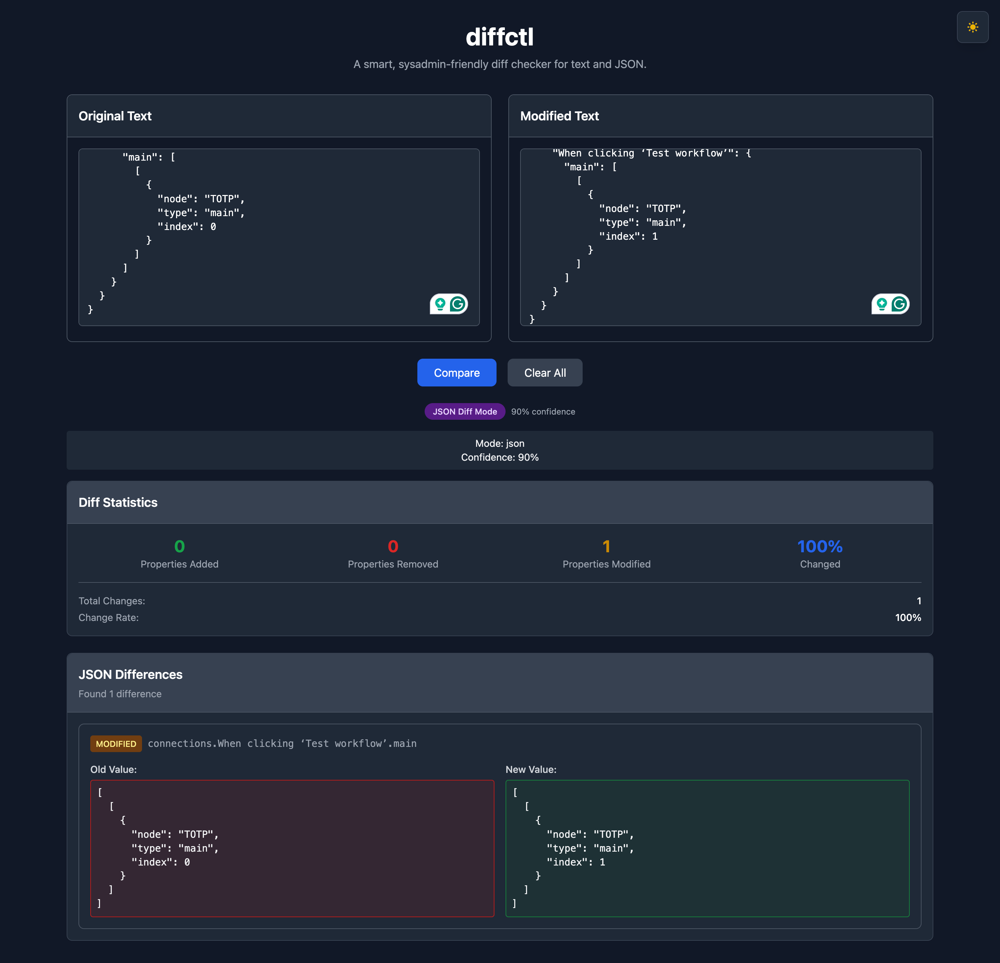

# diffctl

A smart, sysadmin-friendly diff checker for text and JSON. Built for Linux admins and power users, diffctl provides intelligent, side-by-side and unified diffing for text and JSON, with a modern UI and Docker support.

---

## Screenshot



---

## Features

### Core Functionality
- **Intelligent Mode Detection** - Automatically detects whether input is text or JSON
- **Text Diff Mode** - Compare plain text with line-by-line difference highlighting
- **JSON Diff Mode** - Compare JSON objects with structured property-by-property comparison
- **Multiple View Modes** - Unified view and side-by-side comparison
- **Real-time Comparison** - Instant diff results as you type

### Visual Features
- **Syntax Highlighting** - Added content in green, removed in red, unchanged in normal text
- **Diff Statistics** - Shows lines/properties added, removed, and percentage changed
- **Dark/Light Theme** - Toggle between themes with persistent user preference
- **Responsive Design** - Works seamlessly on desktop and mobile devices
- **Modern UI** - Clean, intuitive interface built with Tailwind CSS

### Advanced Features
- **Mode Indicator** - Shows detected mode (text/JSON) with confidence level
- **Error Handling** - Graceful handling of invalid JSON and edge cases
- **No Server Required** - Runs entirely in the browser
- **Docker Support** - Easy deployment with Docker and Docker Compose

## Tech Stack

- **React 18** - Modern React with hooks
- **Vite** - Fast build tool and dev server
- **Tailwind CSS** - Utility-first CSS framework
- **Custom Diff Logic** - Proprietary text and JSON comparison algorithms

## Getting Started

### Option 1: Docker (Recommended)

#### Prerequisites
- Docker and Docker Compose installed on your system

#### Quick Start with Docker

1. Clone the repository:
```bash
git clone <repository-url>
cd diffctl
```

2. Build and run with Docker Compose:
```bash
docker-compose up --build
```

3. Open your browser and navigate to `http://localhost:3000`

#### Docker Commands

- **Start the application**: `docker-compose up`
- **Build and start**: `docker-compose up --build`
- **Stop the application**: `docker-compose down`
- **View logs**: `docker-compose logs -f`

### Option 2: Local Development

#### Prerequisites
- Node.js (version 16 or higher)
- npm or yarn

#### Installation

1. Clone the repository:
```bash
git clone <repository-url>
cd diffctl
```

2. Install dependencies:
```bash
npm install
```

3. Start the development server:
```bash
npm run dev
```

4. Open your browser and navigate to `http://localhost:5173`

### Building for Production

```bash
npm run build
```

The built files will be in the `dist` directory.

## Usage

### Text Comparison
1. Enter your original text in the left textarea
2. Enter your modified text in the right textarea
3. The tool will automatically detect it as text mode
4. Click "Compare" to see the differences
5. Switch between "Unified View" and "Side-by-Side View"

### JSON Comparison
1. Enter your original JSON in the left textarea
2. Enter your modified JSON in the right textarea
3. The tool will automatically detect it as JSON mode
4. Click "Compare" to see structured property differences
5. View added, removed, and modified properties

### Theme Toggle
- Click the theme toggle button in the top-right corner
- Your preference is saved and will persist across sessions

## Project Structure

```
diffctl/
├── public/
│   └── index.html              # Main HTML file
├── src/
│   ├── components/
│   │   ├── EditorPane.jsx      # Text input components
│   │   ├── DiffOutput.jsx      # Unified diff display
│   │   ├── SideBySideDiff.jsx  # Side-by-side diff view
│   │   ├── JsonDiffOutput.jsx  # JSON diff display
│   │   ├── DiffStats.jsx       # Statistics component
│   │   ├── ThemeToggle.jsx     # Theme toggle component
│   │   └── ModeIndicator.jsx   # Mode detection indicator
│   ├── utils/
│   │   ├── diffUtils.js        # Text diff generation
│   │   ├── jsonDiffUtils.js    # JSON diff generation
│   │   └── fileTypeDetector.js # Intelligent mode detection
│   ├── App.jsx                 # Main application component
│   ├── index.css               # Tailwind CSS styles
│   └── main.jsx                # Application entry point
├── tailwind.config.js          # Tailwind configuration
├── postcss.config.js           # PostCSS configuration
├── package.json                # Dependencies and scripts
├── Dockerfile                  # Docker configuration
├── docker-compose.yml          # Docker Compose setup
└── README.md                  # This file
```

## Features in Detail

### Intelligent Mode Detection
The tool automatically analyzes both inputs to determine if they contain:
- **JSON**: Valid JSON objects or arrays with high confidence
- **Text**: Plain text content with line breaks and natural language

### Diff Statistics
For each comparison, the tool provides:
- **Lines/Properties Added**: Count of new content
- **Lines/Properties Removed**: Count of deleted content
- **Percentage Changed**: Overall change percentage
- **Mode-specific Metrics**: Different stats for text vs JSON

### View Modes
- **Unified View**: Single pane showing all changes with +/- indicators
- **Side-by-Side View**: Two panes showing original vs modified side by side

### Theme Support
- **Light Theme**: Clean, bright interface for daytime use
- **Dark Theme**: Easy on the eyes for low-light environments
- **Persistent Preference**: Remembers your choice across sessions

## Contributing

1. Fork the repository
2. Create a feature branch (`git checkout -b feature/amazing-feature`)
3. Commit your changes (`git commit -m 'Add some amazing feature'`)
4. Push to the branch (`git push origin feature/amazing-feature`)
5. Open a Pull Request

## License

This project is licensed under the MIT License - see the [LICENSE](LICENSE) file for details.

## Acknowledgments

- [Tailwind CSS](https://tailwindcss.com/) - Utility-first CSS framework
- [Vite](https://vitejs.dev/) - Next generation frontend tooling
- [React](https://reactjs.org/) - JavaScript library for building user interfaces 